# Preparación del Laboratorio

## Introducción
Para crear el laboratorio se ha empleado *cuckoo sandbox*. Cuckoo sandbox es un framework de código abierto que permite automatizar pruebas con malware en máquinas virtuales y, además, extraer conclusiones sobre de su comportamiento en forma de informes.

En nuestro caso se ha empleado la versión **cuckoo sandbox 2.0.7**. Es la última versión disponible de este framework, liberado el 27 de Junio de 2020. Como se indica en este manual [cuckooSandboxManual](https://readthedocs.org/projects/cuckoo/downloads/pdf/stable/), los componentes del host están escritos en python, recomendando la versión 2.7 con soporte total. Versiones posteriores de python no están soportadas actualmente (aunque están en la lista de **TODOs** del repositorio).

De todas maneras, hay un código en desarrollo (no recomendado para entornos de producción) reescrito para ser compatible con python 3 [cuckooPython3](https://reversingfun.com/posts/cuckoo-3-installation-guide/).

## Preparación del equipo Host
Características del equipo:
- Ubuntu 20.04 TLS
- Modelo: Lenovo ThinkPad T450s
- 12 GB de RAM
- Intel(R) Core(TM) i7-5600U CPU @ 2.60GHz

Procedemos a instalar las dependencias necesarias, según los requisitos [cuckooReq](https://cuckoo.readthedocs.io/en/latest/installation/host/requirements/#installing-python-libraries-on-ubuntu-debian-based-distribution) enumerados en la documentación de *cuckoo*.

### Instalar y configurar python 2.7.18 por defecto
Es necesario instalar la versión python 2, ya que ubuntu viene con la versión python 3 instalada por defecto. Esto es debido, ya que la versión 2.7 [installPython27](https://linux.how2shout.com/how-to-install-python-2-7-on-ubuntu-20-04-lts/) dejó de mantenerse desde el 1 de Enero de 2020.

Se añade el repositorio *universe* y se procede a descargar los paquetes nuevos a actualizar.

```bash
$ sudo apt-add-repository universe
$ sudo apt update
```

Se instala la version python 2.7 con el comando:

```bash
$ sudo apt install python2-minimal
```

Finalmente, la versión instalada es

```bash
$ python2 -V
  Python 2.7.18
```

Ahora mismo se cuenta con dos versiones de python en el sistema.

```bash
$ ls /usr/bin/python*
/usr/bin/python            /usr/bin/python3.10
/usr/bin/python2           /usr/bin/python3.10-config
/usr/bin/python2.7         /usr/bin/python3-config
/usr/bin/python2.7-config  /usr/bin/python3-futurize
/usr/bin/python2-config    /usr/bin/python3-pasteurize
/usr/bin/python3
```

Asi que se configura python 2.7 como versión por defecto, mediante el comando *update-alternatives*.

```bash
sudo update-alternatives --install /usr/bin/python python /usr/bin/python2 1
sudo update-alternatives --install /usr/bin/python python /usr/bin/python3 2
```

y queda configurada la version 2.7 por defecto

```bash
$ python -V
Python 2.7.18
```

Para instalar paquetes de python, es necesario instalar *pip*. Se trata del gestor de paquetes de python, una herramienta de línea de comandos para instalar, actualizar y gestionar los paquetes de python y sus dependencias.

Se usa *curl* para obtener dicho script.
Curl (también escrito cURL) es una herramienta y biblioteca de línea de comandos que se utiliza para transferir datos hacia o desde un servidor. Es una utilidad versátil que admite varios protocolos, incluidos HTTP, HTTPS, FTP, SMTP y más. *Curl* le permite enviar solicitudes a una URL específica y recibir los datos resultantes.

```bash
$ sudo apt update 
$ sudo apt install curl 
$ curl https://bootstrap.pypa.io/pip/2.7/get-pip.py --output get-pip.py
$ sudo python2 get-pip.py
```

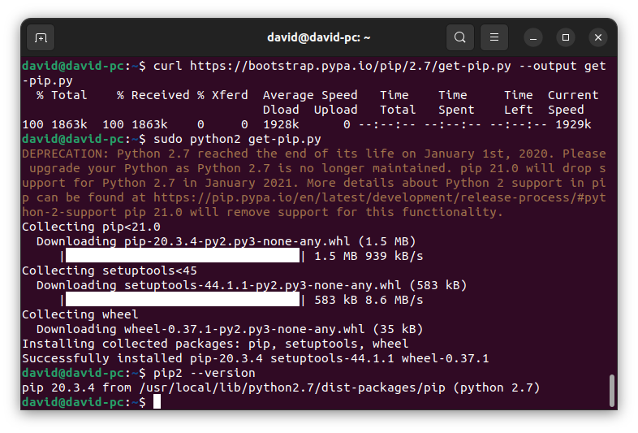

## Cuckoo: Requisitos

### Librerias de python

```bash
$ sudo apt-get install python-pip python2-dev libffi-dev libssl-dev
$ sudo apt-get install libxml2-dev libxslt-dev
$ sudo pip2 install virtualenv
$ sudo apt-get install libjpeg-dev zlib1g-dev swig
```

### Instalar MongoDB
Para utilizar la interfaz web basada en Django, se requiere MongoDB
Para instalarlo realizamos los siguientes pasos [installMongoDB](https://www.digitalocean.com/community/tutorials/how-to-install-mongodb-on-ubuntu-20-04).:

```bash
$ curl -fsSL https://www.mongodb.org/static/pgp/server-4.4.asc | sudo apt-key add -
Warning: apt-key is deprecated. Manage keyring files in trusted.gpg.d instead (see apt-key(8)).
OK
```

Para comprobar que se ha aniadido de forma correcta

```bash
$ apt-key list
Warning: apt-key is deprecated. Manage keyring files in trusted.gpg.d instead (see apt-key(8)).
/etc/apt/trusted.gpg
--------------------
pub   rsa4096 2019-05-28 [SC] [caduca: 2024-05-26]
      2069 1EEC 3521 6C63 CAF6  6CE1 6564 08E3 90CF B1F5
uid        [desconocida] MongoDB 4.4 Release Signing Key <packaging@mongodb.com>

/etc/apt/trusted.gpg.d/ubuntu-keyring-2012-cdimage.gpg
------------------------------------------------------
pub   rsa4096 2012-05-11 [SC]
      8439 38DF 228D 22F7 B374  2BC0 D94A A3F0 EFE2 1092
uid        [desconocida] Ubuntu CD Image Automatic Signing Key (2012) <cdimage@ubuntu.com>

/etc/apt/trusted.gpg.d/ubuntu-keyring-2018-archive.gpg
------------------------------------------------------
pub   rsa4096 2018-09-17 [SC]
      F6EC B376 2474 EDA9 D21B  7022 8719 20D1 991B C93C
uid        [desconocida] Ubuntu Archive Automatic Signing Key (2018) <ftpmaster@ubuntu.com>

```

El siguiente comando es necesario para indicar de donde hay que recuperar mongoDB

```bash
$ echo "deb [ arch=amd64,arm64 ] https://repo.mongodb.org/apt/ubuntu focal/mongodb-org/4.4 multiverse" | sudo tee /etc/apt/sources.list.d/mongodb-org-4.4.list
```


Ahora es necesario actualizar el índice local de paquetes del servidor

```bash
$ sudo apt update
$ sudo apte install mongodb-org
```

Si el anterior comando no funciona, es necesario realizar estos otros pasos [installWorkadoundMongoDB](https://github.com/dotnet/sdk/issues/25441).


Bajar la libreria del repositorio oficial e instalarla
```bash
$ wget http://archive.ubuntu.com/ubuntu/pool/main/o/openssl/libssl1.1_1.1.1f-1ubuntu2_amd64.deb
$ sudo dpkg -i libssl1.1_1.1.1f-1ubuntu2_amd64.deb$
```

Una vez hecho esto, ya es posible instalar mongoDB
```bash
sudo apt-get install -y mongodb-org
```

Ahora arrancamos mongodb. Despues configuramos el servicio para que siempre se inicie al arrancar el ordenador y se verifica su funcionamiento

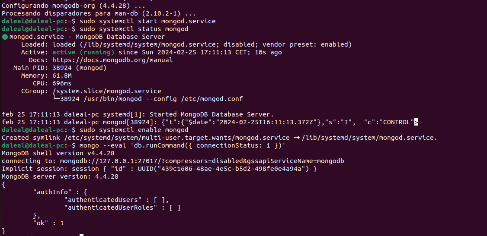


### Instalar Postgress como base de datos

```bash
$ sudo apt-get install postgresql libpq-dev -y
```

### Instalar VirtualBox
Usaremos Virtual Box como herramienta para virtualizacion en vez de kvm, ya que emplearemos otra herramienta llamada [vmcloak](https://vmcloak.readthedocs.io/en/latest/)., la cual nos permite cargar de manera ágil y dinámica máquintas virtuales e imágenes.

```bash
$ sudo apt install virtualbox -y
```

### Instalar Volatility

Descargar la herramienta de [volatility](https://www.volatilityfoundation.org/releases), en concreto la version 2.7, extraer y ejecutar

```bash
$ sudo python setup.py install
```

### Instalar Distorm

Bajar la version 3.5.2 de [distorm](https://github.com/gdabah/distorm/releases), extraer y ejecutar
```bash
$ sudo python setup.py install
```

### Instalar Yara

Bajar la version 3.11 de [Yara](https://github.com/VirusTotal/yara/releases)
Extraer la carpeta y ejecutar  [pasos](https://yara.readthedocs.io/en/latest/gettingstarted.html):

```bash
$ sudo apt-get install automake libtool make gcc pkg-config
            
$ sudo apt-get install libjansson-dev 
$ sudo apt-get install libmagic-dev
$ ./bootstrap.sh
$ ./configure --with-crypto --enable-magic --enable-cuckoo
$ make
$ sudo make install
```

Para comprobar la instalación, se pueden ejecutar los tests

```bash
make check
...
  CCLD     test-re-split
  CC       tests/test-exception.o
  CCLD     test-exception
PASS: test-alignment
PASS: test-atoms
PASS: test-api
PASS: test-rules
PASS: test-pe
PASS: test-elf
PASS: test-version
PASS: test-bitmask
PASS: test-math
PASS: test-stack
PASS: test-re-split
PASS: test-exception
============================================
Testsuite summary for yara 3.11.0
============================================
# TOTAL: 12
# PASS:  12
# SKIP:  0
# XFAIL: 0
# FAIL:  0
# XPASS: 0
# ERROR: 0
============================================

```

### Instalar PyCrypto

Bajar la version 3.5.2 de [pycrypto](https://www.dlitz.net/software/pycrypto/), extraer y ejecutar
```bash
$ sudo python setup.py install
```

### Instalar Pil


```bash
$ sudo apt-get install libjpeg8 libjpeg62-dev libfreetype6 libfreetype6-dev
$ pip install Pillow
```

### Instalar OpenPyxl


```bash
pip install openpyxl
```

### Instalar ujson

```bash
pip install ujson
```

### Instalar Iphyton

```bash
$ pip install jupyter
```

Si no funciona, usar esta opcion:
```bash
$ pip install ipywidgets==7.5 comm==0.0.1
$ pip install jupyter ipywidgets==7.5 comm==0.0.1
```


### Instalar TCPDUMP

Es necesario para analizar el trafico de entrada y salida del sandbox

```bash
$ sudo apt-get install tcpdump apparmor-utils -y
```

Crear el pcap group
```bash
$ sudo groupadd pcap
```

Añadir el grupo 
```bash
$ sudo usermod -a -G pcap NOMBRE_USUARIO
```

en nuestro caso
```bash
$ sudo usermod -a -G pcap daleal
$ sudo chgrp pcap /usr/bin/tcpdump
$ sudo setcap cap_net_raw,cap_net_admin=eip /usr/bin/tcpdump
```

Verificar que es correcto
```bash
$ getcap /usr/bin/tcpdump
/usr/bin/tcpdump cap_net_admin,cap_net_raw=eip
```


Y vamos a deshabilitar esto, para que cuckoo sea capaz de analizar el trafico
```bash
$ sudo aa-disable /usr/bin/tcpdump
Disabling /usr/bin/tcpdump.
```

### Instalar Librerias auxiliares

```bash
sudo apt-get install swig
sudo pip install m2crypto==0.39.0
```

## Configuracion del entorno Virtual

Lo primero que se debe hacer es dar permisos al usuario para poder ejecutar *virtualbox*

```bash
sudo usermod -a -G vboxusers daleal
```

Para realizar la configuracion del entorno de una manera más ágil, se puede copiar y ejecutar el siguiente script para configurar el entorno virtual

```bash

#!/usr/bin/env bash

# NOTES: Run this script as: sudo -u <USERNAME> cuckoo-setup-virtualenv.sh

# install virtualenv
sudo apt-get update && sudo apt-get -y install virtualenv

# install virtualenvwrapper
sudo apt-get -y install virtualenvwrapper

echo "source /usr/share/virtualenvwrapper/virtualenvwrapper.sh" >> ~/.bashrc

# install pip for python3
sudo apt-get -y install python3-pip

# turn on bash auto-complete for pip
pip3 completion --bash >> ~/.bashrc

# avoid installing with root
pip3 install --user virtualenvwrapper

echo "export VIRTUALENVWRAPPER_PYTHON=/usr/bin/python3" >> ~/.bashrc

echo "source ~/.local/bin/virtualenvwrapper.sh" >> ~/.bashrc

export WORKON_HOME=~/.virtualenvs

echo "export WORKON_HOME=~/.virtualenvs" >> ~/.bashrc

echo "export PIP_VIRTUALENV_BASE=~/.virtualenvs" >> ~/.bashrc

```


### Crear el entorno virtual
Esto lo realizaremos con la version de python 2.7, la cual es la recomendada para entornos de produccion. El nombre será *cuckoo-test*

```bash
$ mkvirtualenv -p python2.7 cuckoo-test
```


Ahora, se debe actualizar el entorno virtual

```bash
$ pip install -U pip setuptools
```

Todos los comandos se ejecutaran en este entorno con la version 2.7 de python, ya que lo creamos asi en el anterior comando.

Ahora realizamos la instalación de *cuckoo*
```bash
$ pip install -U cuckoo
```


### Descargar las imagenes para VirtualBox

En este caso hemos elegido una version de Windows7 que se puede descargar desde la siguiente ubicación:


```bash
$ sudo wget https://cuckoo.sh/win7ultimate.iso
$ sudo mkdir /mnt/win7
$ sudo chown daleal:daleal /mnt/win7/
$ sudo mount -o ro,loop win7ultimate.iso /mnt/win7
```

*VMCloak* es una herramienta que permite la creación y gestión de máquinas virtuales para el análisis de malware. Su principal ventaja radica en la capacidad de automatizar el proceso de configuración y toma de instantáneas (snapshots) de las máquinas virtuales, lo que facilita la realización de análisis repetitivos y la restauración rápida a un estado limpio.

Para instalar *VMCloak*, se sigue un proceso que implica la configuración inicial de la máquina virtual, la instalación de las herramientas necesarias para el análisis de malware, la toma de instantáneas para diferentes estados del sistema, y la automatización de estos pasos para futuros análisis.

El potencial de *VMCloak* radica en su capacidad para simplificar y agilizar el proceso de análisis de malware, permitiendo a los investigadores realizar pruebas en entornos controlados y restaurar rápidamente la máquina virtual a un estado limpio en caso de ser necesario. Además, al automatizar la configuración y toma de instantáneas, *VMCloak* optimiza el tiempo dedicado a tareas repetitivas y tediosas, permitiendo a los analistas enfocarse en la investigación y el análisis de amenazas de manera más eficiente.

Para ello, se instalan las dependencias necesarias previamente y luego la herramienta en sí. Cabe recordar que todas estas acciones se realizan dentro del entorno virtual creado.


```bash
sudo apt-get -y install build-essential libssl-dev libffi-dev python2-dev genisoimage
sudo apt-get -y install zlib1g-dev libjpeg-dev
sudo apt-get -y install python-pip python-virtualenv python-setuptools swig


pip install -U vmcloak
```

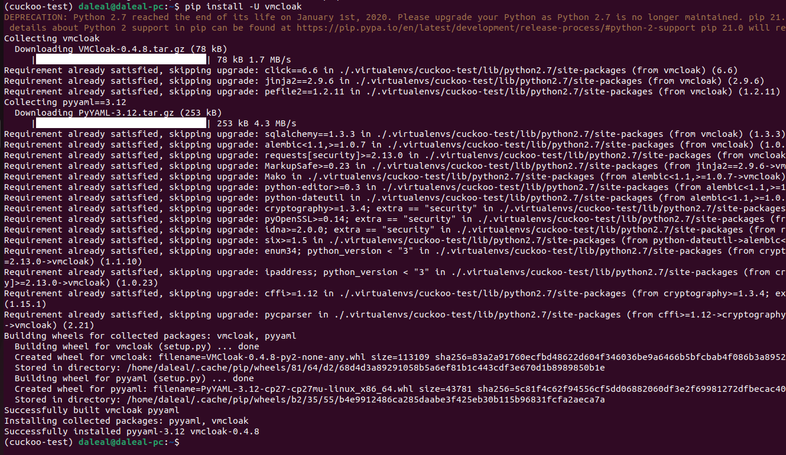


En primer lugar es necesario crear una red virtual, donde nuesro sandbox correrá

```bash
(cuckoo-test) daleal@daleal-pc:~$ vmcloak-vboxnet0
0%...10%...20%...30%...40%...50%...60%...70%...80%...90%...100%
Interface 'vboxnet0' was successfully created
(cuckoo-test) daleal@daleal-pc:~$
```

Ahora se instala Windows 7 con la iso previamente descargada, configurando una máquina con 2 cpus y 2GB de memoria RAM.

```bash
$ vmcloak init --verbose --win7x64 win7x64base1 --cpus 2 --ramsize 2048
```

Debido al empleo de versiones no compatibles, puede producirse un error al ejecutar el comando anterior. Este fallo se puede encontrar para el parametro *rec_screen0*, al ver la respuesta producida por el siguiente comando, ya que devuelve un valor que no coindide con la pareja clave valor esperada. 

```bash
$ VBoxManage showvminfo "Nombre de tu maquina virtual"
```

Para arreglar este error, es necesario modificar el fichero *pm.vy*, que está localizado en la siguiente ruta (dependiendo de la instalación realizada):

```bash
/home/daleal/.virtualenvs/cuckoo-test/lib/python2.7/site-packages/vmcloak/vm.py
```

Dentro, modificamos el siguiente método de esta forma:

```bash
     45     def vminfo(self, element=None):
     46         ret = {}
     47         lines = self._call("showvminfo", self.name, machinereadable=True)
     48         for line in lines.split("\n"):
     49             
     50             #Add an exception here for rec_screen0. convert this boolean to =0 or =1
     51             if "=" not in line:
     52                 if line.endswith("0"):
     53                         line = line[:-1] + "=0"
     54                 else:
     55                         line = line[:-1] + "=1"
     56             
     57             key, value = line.split("=", 1)
     58 
     59             if value.startswith('"') and value.endswith('"'):
     60                 value = value[1:-1]
     61             elif value.isdigit():
     62                 value = int(value)
     63 
     64             if key.startswith('"') and key.endswith('"'):
     65                 key = key[1:-1]
     66 
     67             ret[key] = value
     68         return ret if element is None else ret.get(element)
```

Después clonamos la máquina virtual

```bash
vmcloak clone win7x64base1 win7x64NewCuckoo
```

Es posible instalar el software/dependencias con el que queramos ampliar la imagen del Windows. Para listar las dependencias posibles, se usa el siguiente comando

```bash
vmcloak list deps
```

Un ejemplo para instalar dependencias sería el siguiente:

```bash
vmcloak install --debug win7x64cuckoo java:7u80 vcredist:2013 edge ie11 adobepdf wallpaper disableservices
```

Una vez la máquina está en el estado final que deseamos, se crea un snapshot, que es la que será usada en el laboratorio

```bash
vmcloak snapshot --debug --count 1 win7x64NewCuckoo win7vm_
```

mientras se está creando, puede producirse un problema con la ip, ya que la imagen parece tener la *ip* fija *192.168.52.2* y hemos especificado la red es la *192.168.52.1*, entonces al hacer el snapshot se hace ping a la *ip 192.168.52.2* y la encuentra, pero luego se intenta hacer ping a la *ip 192.168.52.101*, pero no la cambia y el proceso no terminaría. Asi que, para arreglarlo se puede entrar en virtualbox, y se cambia la ip a mano por *192.168.52.101*. Una vez hecho esto, la creacion del snapshot termina.


Para comprobar que las vms se han creado correctamente, se ejecuta

```bash
$ vmcloak list vms
/home/daleal/.virtualenvs/cuckoo-test/lib/python2.7/site-packages/OpenSSL/crypto.py:14: CryptographyDeprecationWarning: Python 2 is no longer supported by the Python core team. Support for it is now deprecated in cryptography, and will be removed in the next release.
  from cryptography import utils, x509
win7vm_1 192.168.56.101
```

Ya casi el proceso para arrancar cuckoo esta terminado, pero antes se necesario ejecutar los siguientes comandos para crear las \textit{iptables rules}. Esto permite a la máquina virtual, a traves de la interfaz configurada, acceder a internet para poder realizar un análisis más profundo (por ejemplo, detectar Command and Control server)


```bash
$ sudo sysctl -w net.ipv4.conf.vboxnet0.forwarding=1
net.ipv4.conf.vboxnet0.forwarding = 1
```


Ahora es necesario obtener el nombre de la interfaz de red y configurar el *fordwarding*


```bash
$ ip a
1: lo: <LOOPBACK,UP,LOWER_UP> mtu 65536 qdisc noqueue state UNKNOWN group default qlen 1000
    link/loopback 00:00:00:00:00:00 brd 00:00:00:00:00:00
    inet 127.0.0.1/8 scope host lo
       valid_lft forever preferred_lft forever
    inet6 ::1/128 scope host 
       valid_lft forever preferred_lft forever
2: enp0s25: <NO-CARRIER,BROADCAST,MULTICAST,UP> mtu 1500 qdisc fq_codel state DOWN group default qlen 1000
    link/ether 50:7b:9d:27:aa:67 brd ff:ff:ff:ff:ff:ff
3: wwan0: <BROADCAST,MULTICAST,NOARP> mtu 1428 qdisc noop state DOWN group default qlen 1000
    link/ether b2:4d:eb:01:45:73 brd ff:ff:ff:ff:ff:ff
4: wlp3s0: <BROADCAST,MULTICAST,UP,LOWER_UP> mtu 1500 qdisc noqueue state UP group default qlen 1000
    link/ether 4c:34:88:8d:59:a0 brd ff:ff:ff:ff:ff:ff
    inet 192.168.1.156/24 brd 192.168.1.255 scope global dynamic noprefixroute wlp3s0
       valid_lft 82352sec preferred_lft 82352sec
    inet6 2a0c:5a83:7007:2e00:dadf:5fd7:6f08:8156/64 scope global temporary dynamic 
       valid_lft 600761sec preferred_lft 82272sec
    inet6 2a0c:5a83:7007:2e00:d646:fa66:bcd5:1d7b/64 scope global mngtmpaddr noprefixroute 
       valid_lft forever preferred_lft forever
    inet6 fe80::12a6:26c:ed31:1916/64 scope link noprefixroute 
       valid_lft forever preferred_lft forever
5: vboxnet0: <NO-CARRIER,BROADCAST,MULTICAST,UP> mtu 1500 qdisc fq_codel state DOWN group default qlen 1000
    link/ether 0a:00:27:00:00:00 brd ff:ff:ff:ff:ff:ff
    inet 192.168.56.1/24 brd 192.168.56.255 scope global vboxnet0
       valid_lft forever preferred_lft forever
```

En nuestro caso es *wlp3s0*


```bash
$ sudo sysctl -w net.ipv4.conf.wlp3s0.forwarding=1
net.ipv4.conf.wlp3s0.forwarding = 1
```

Para hacer persistentes los cambios en el sistema y no tener que realizarlos en cada reinicio, podemos añadir las líneas al fichero */etc/sysctl.conf*

```bash
####################################
# Magic system request Key
# 0=disable, 1=enable all, >1 bitmask of sysrq functions
# See https://www.kernel.org/doc/html/latest/admin-guide/sysrq.html
# for what other values do
#kernel.sysrq=438
net.ipv4.conf.vboxnet0.forwarding=1
net.ipv4.conf.wlp3s0.forwarding=1
```

Después se crean la iptables rules, para permitir que el tráfico que corre dentro de la máquina virtual pueda salir a internet.


```bash
sudo iptables -t nat -A POSTROUTING -o wlp3s0 -s 192.168.56.0/24 -j MASQUERADE
sudo iptables -P FORWARD DROP
sudo iptables -A FORWARD -m state --state RELATED,ESTABLISHED -j ACCEPT
sudo iptables -A FORWARD -s 192.168.56.0/24 -j ACCEPT

$ sudo iptables -vnL
Chain INPUT (policy ACCEPT 0 packets, 0 bytes)
 pkts bytes target     prot opt in     out     source               destination         

Chain FORWARD (policy DROP 0 packets, 0 bytes)
 pkts bytes target     prot opt in     out     source               destination         
    0     0 ACCEPT     all  --  *      *       0.0.0.0/0            0.0.0.0/0            state RELATED,ESTABLISHED
    0     0 ACCEPT     all  --  *      *       192.168.56.0/24      0.0.0.0/0           

Chain OUTPUT (policy ACCEPT 0 packets, 0 bytes)
 pkts bytes target     prot opt in     out     source               destination  
 
```


Con esto ya es posible arrancar *cuckoo*, para ello volvemos al entorno virtual y ejecutamos *cuckoo init*:


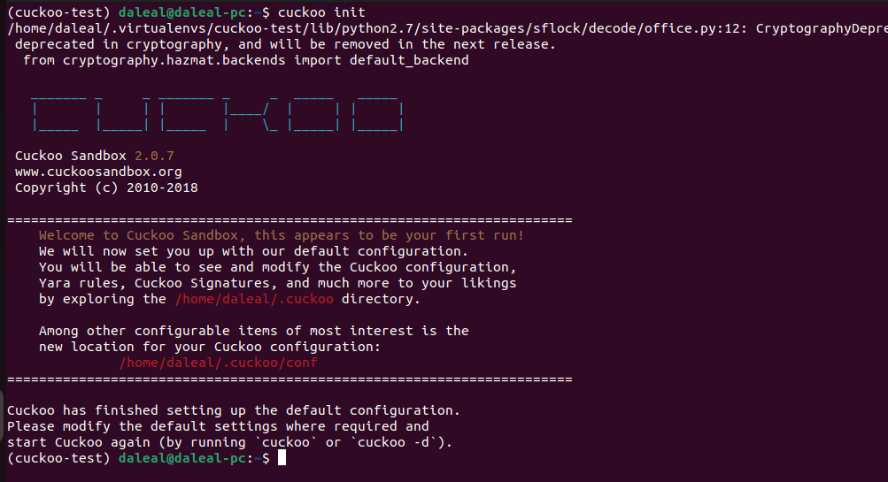


Ahora es necesario descargar las reglas de ficheros y lo necesario para habilitar *cuckoo* correctamente y que sea capaz de detectar *malware*. La instrucción *cuckoo community* se encarga de esto


```bash
$ cuckoo community
/home/daleal/.virtualenvs/cuckoo-test/lib/python2.7/site-packages/sflock/decode/office.py:12: CryptographyDeprecationWarning: Python 2 is no longer supported by the Python core team. Support for it is now deprecated in cryptography, and will be removed in the next release.
  from cryptography.hazmat.backends import default_backend
2024-03-28 18:41:15,339 [cuckoo.apps.apps] INFO: Downloading.. https://github.com/cuckoosandbox/community/archive/master.tar.gz
2024-03-28 18:41:20,136 [cuckoo] INFO: Finished fetching & extracting the community files!
```

Se configura *cuckoo* para que sea capaz de conectar a la máquina virtual, al routing creado.
Para ello abrimos otro terminal y ejecutamos el comando, dando permisos *sudo* al usuario. Este terminal quedará corriendo con el comando ejecutado

```bash
$ cuckoo rooter --sudo --group daleal
/home/daleal/.virtualenvs/cuckoo-test/lib/python2.7/site-packages/sflock/decode/office.py:12: CryptographyDeprecationWarning: Python 2 is no longer supported by the Python core team. Support for it is now deprecated in cryptography, and will be removed in the next release.
  from cryptography.hazmat.backends import default_backend
sudo contrasena para daleal: 
/home/daleal/.virtualenvs/cuckoo-test/lib/python2.7/site-packages/sflock/decode/office.py:12: CryptographyDeprecationWarning: Python 2 is no longer supported by the Python core team. Support for it is now deprecated in cryptography, and will be removed in the next release.
  from cryptography.hazmat.backends import default_backend
2024-03-28 19:19:40,075 [cuckoo] INFO: Starting Cuckoo Rooter (group=daleal)!
```


En la terminal previa, se ingresa en la carpeta de configuracion de *cuckoo* y para editar el fichero \textit{virtualbox.conf}. En él, se indica la máquina virutal configurada. Esto puede realizarse de forma manual o mediante el siguiente comando.

```bash
$ while read -r vm ip; do cuckoo machine --add $vm $ip; done < <(vmcloak list vms)
/home/daleal/.virtualenvs/cuckoo-test/lib/python2.7/site-packages/OpenSSL/crypto.py:14: CryptographyDeprecationWarning: Python 2 is no longer supported by the Python core team. Support for it is now deprecated in cryptography, and will be removed in the next release.
  from cryptography import utils, x509
/home/daleal/.virtualenvs/cuckoo-test/lib/python2.7/site-packages/sflock/decode/office.py:12: CryptographyDeprecationWarning: Python 2 is no longer supported by the Python core team. Support for it is now deprecated in cryptography, and will be removed in the next release.
  from cryptography.hazmat.backends import default_backend
(cuckoo-test) daleal@daleal-pc:~/.cuckoo/conf$
```

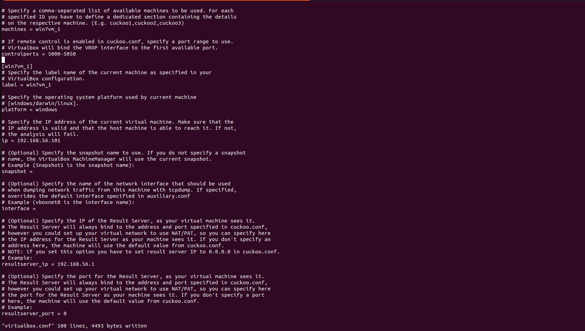


La pega de este comando, es que la máquina *cuckoo1* que estaba creada por defecto debe eliminarse manualmente y solo dejar nuestra máquina virtual configurada.

Una vez hecho esto, ahora es necesario configurar el fichero *routing.conf*. En nuestro caso, elegimos la opción de routing *routing* y se escribe el nombre la interfaz de nuestro equipo host: *wlp3s0*


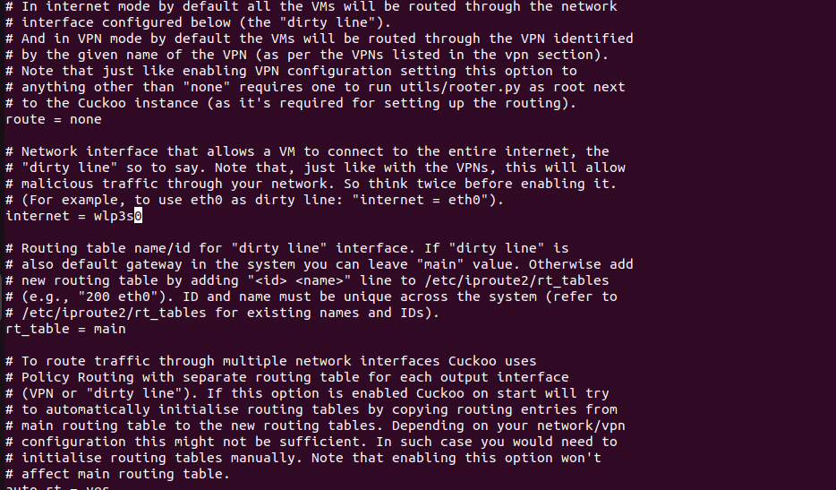


Despues se edita el fichero *reporting.conf*, la parte de *mongo.db* (previmante instalado), donde básicamente se habilita

```bash
[mongodb]
enabled = yes
host = 127.0.0.1
port = 27017
db = cuckoo
store_memdump = yes
paginate = 100
# MongoDB authentication (optional).
username =
password =
```


Con esto ya está todo configurado, y es hora de problarlo. Por un lado tenemos el terminal con el comando *cuckoo router* corriendo

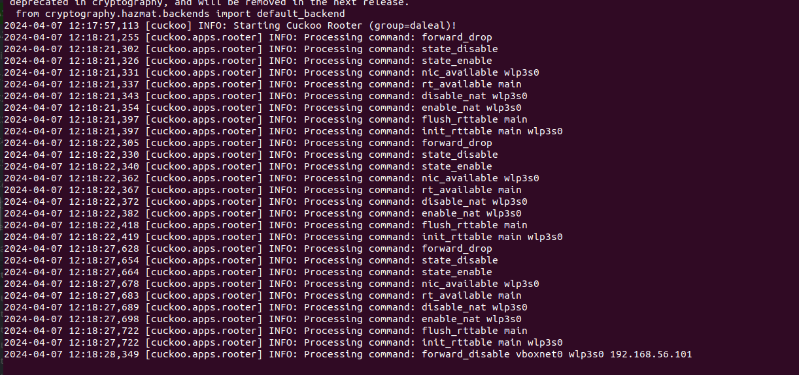


Y procedemos a abrir otros dos terminales. Uno con el comando **cuckoo --debug**

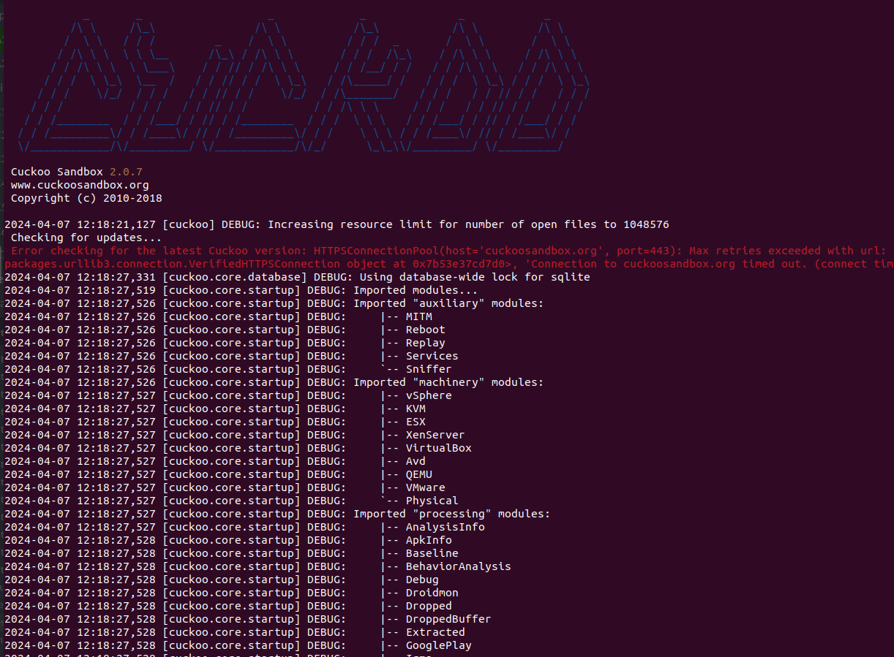


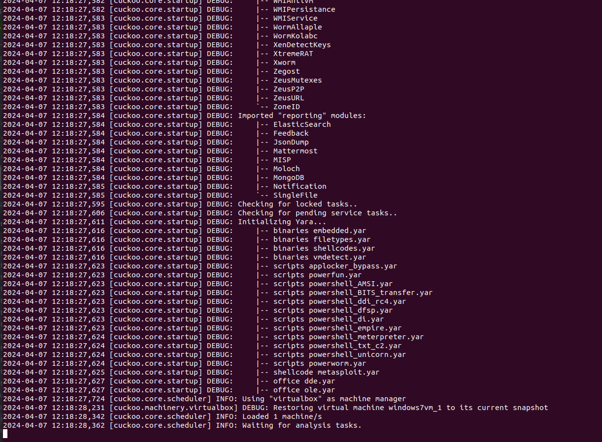


Donde se observarán logs del análisis que se esta realizando. En la imagen se puede apreciar como la máquina virtual configurada ha sido encontrada y está esperando tareas de análisis.

Cuckoo cuenta con una aplicación web que facilita la interacción con esta herramienta. Cuckoo Sandbox automatiza el análisis dinámico de malware en un entorno virtual creado y controlado por el usuario. Esto permite ejecutar, analizar y recopilar información sobre el malware mientras se ejecuta en un entorno aislado, conocido como "sandbox". Para arrancarlo es necesario ejecutar en otro terminal *cuckoo web --host 127.0.0.1 --port 8080*


Accediendo a la dirección previamente especificada en el navegador

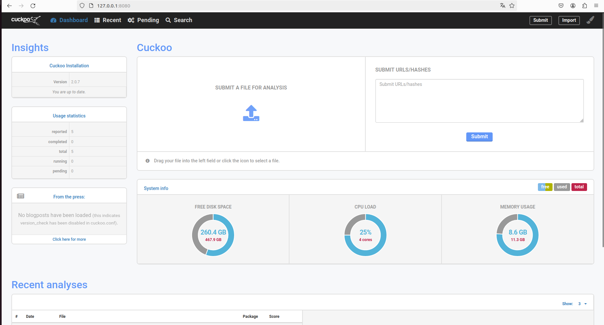


Como ejemplo, vamos a subir un fichero malware para su análisis. Para esto, solo es necesario hacer click on \textit{submit} y seleccionar el fichero. Una vez hecho esto, se accede a otra ventana de la aplicación, donde se seleccionan algunas características del tipo de análisis y se hace click en *Analyze*


En análisis arranca, y mientras la aplicación web nos lleva a otra ventana donde se indica el estado *running* de la tarea de análisis creada, en el terminal en modo debug, se pueden apreciar las diferentes acciones llevadas a cabo.

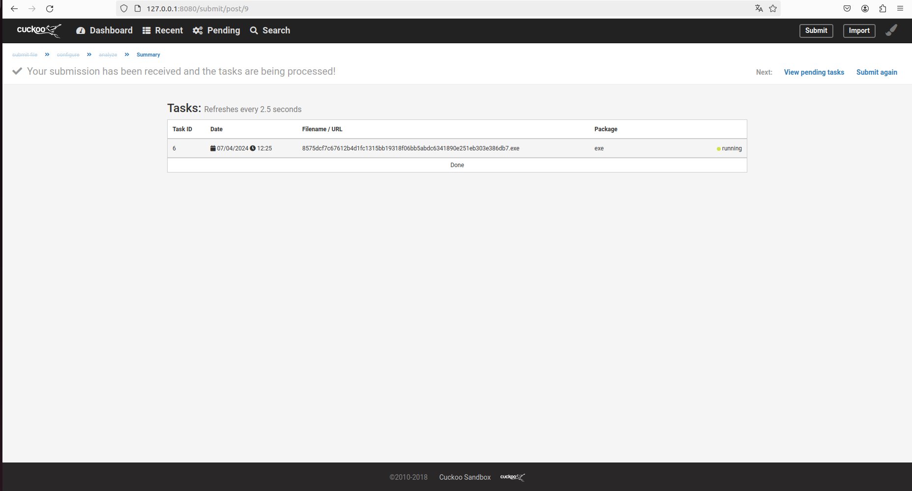

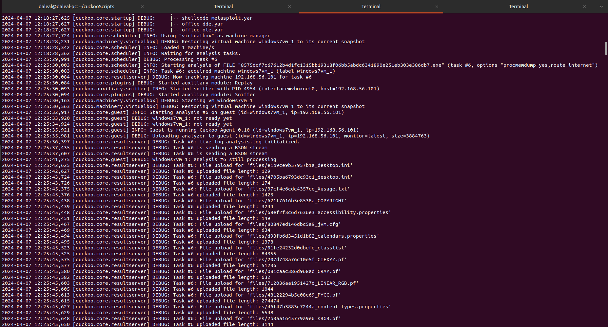


Cuando la tarea es completada, en la ventana de *summary* aparece el resultado del análisis de la tarea.


Navegando por el menú de la izquierda, se pueden obtener diferentes datos del análisis:

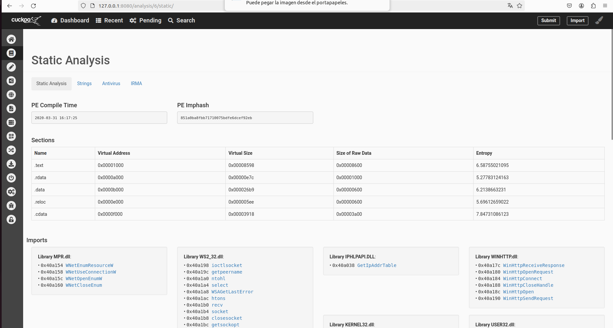


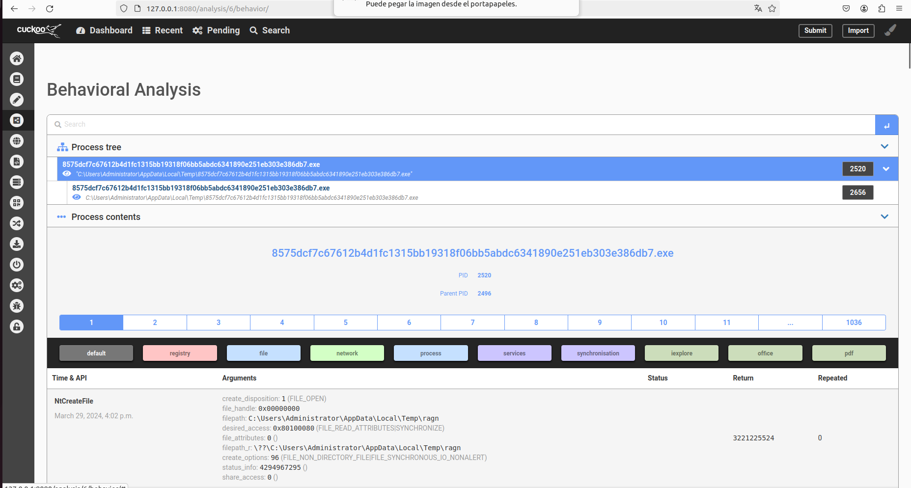


Estos reportes se generan en formato *json* en la siguiente ruta, la cual será usada para obtener las características necesarias para el estudio, aunque esta parte será descrita más adelante.


